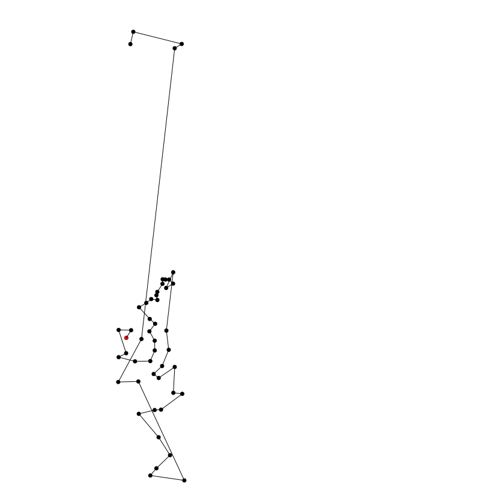

## Travelling Salesman greedy implementation

### Install
`npm install`

### Run
`node main.js ../../capitals.txt` or `npm start`

### Run tests
`npm test`

### Run using Docker
```
docker build -t salesman-greedy .
docker run -v `pwd`:/home/data salesman-greedy node main ../data/capitals.txt /home/data
```

### Result generated using capitals.txt
Red point is start.

